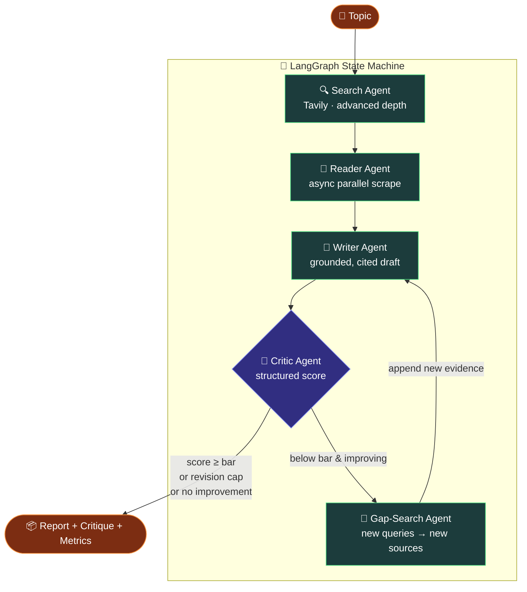
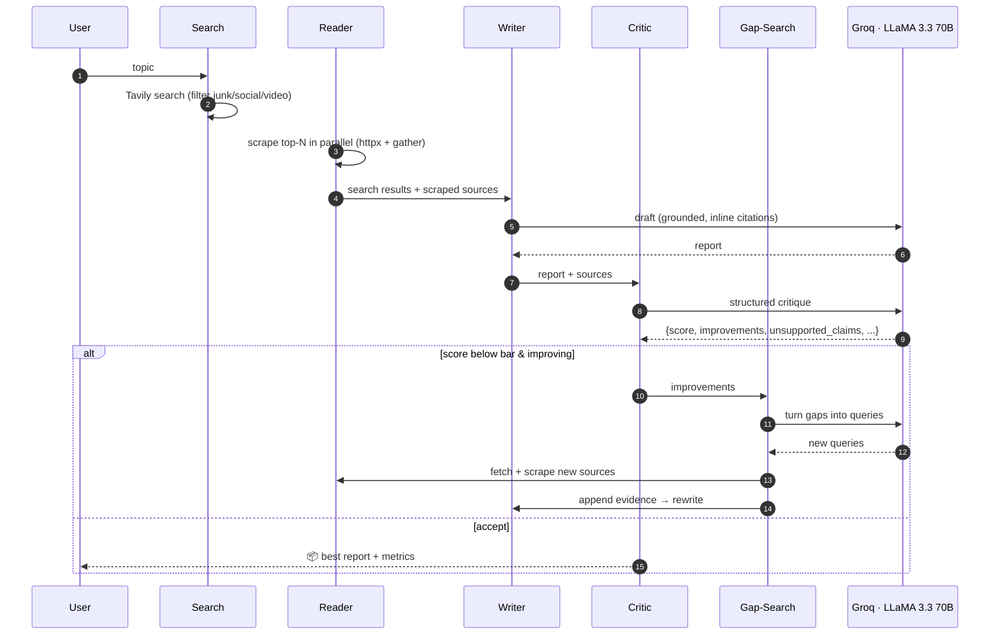
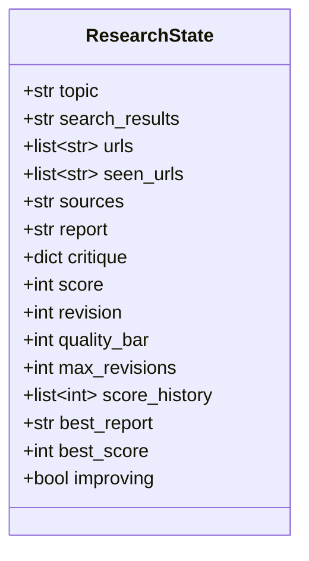

# 🧠 ResearchMind — Self-Refining Multi-Agent Research System

> A production-minded, **LangGraph**-powered research agent that searches the web, scrapes sources in parallel, writes a grounded report, and **critiques and re-researches its own work** until the draft clears a quality bar — with full cost tracing, automated evaluation, reliability, tests, and a **live deployment**.

<p align="center">
  <a href="https://researchmind-8wxf.onrender.com/"></a>
  
  
  
  
  
  
</p>

**🔗 Live demo:** https://researchmind-8wxf.onrender.com/
_(free tier — first load after idle may take ~30–60s to wake)_

---

## 📋 Table of Contents

- [Overview](#-overview)
- [Key Capabilities](#-key-capabilities)
- [System Architecture](#-system-architecture)
- [The Self-Refinement Loop](#-the-self-refinement-loop)
- [Pipeline Flow](#-pipeline-flow)
- [Agents & Components](#-agents--components)
- [Pipeline State](#-pipeline-state)
- [Reliability & Production Concerns](#-reliability--production-concerns)
- [Observability — Cost / Token / Latency](#-observability--cost--token--latency)
- [Evaluation Harness](#-evaluation-harness)
- [Measured Results](#-measured-results)
- [Tech Stack](#-tech-stack)
- [Project Structure](#-project-structure)
- [Installation](#-installation)
- [Configuration](#-configuration)
- [Usage](#-usage)
- [Deployment](#-deployment)
- [Testing](#-testing)
- [Design Decisions](#-design-decisions)
- [Roadmap](#-roadmap)
- [License](#-license)

---

## 🔎 Overview

**ResearchMind** turns a single topic into a grounded, cited research report using four coordinated agents on a **LangGraph state machine**. Unlike a linear pipeline, the **Critic controls the flow**: it scores each draft and, when the draft falls short, routes control through a **gap-search** agent that gathers _new_ evidence before the Writer rewrites — so refinement improves substance, not just wording.

The system is built to be _operated_, not just demoed: every run is traced for **tokens, cost, and latency**; an **evaluation harness** scores report quality and faithfulness against sources; a **reliability layer** retries transient failures and degrades gracefully; an offline **test suite** guards the core logic; and the whole thing is **deployed live** on Render as a streaming web app.

|                |                                                                             |
| -------------- | --------------------------------------------------------------------------- |
| **Input**      | A research topic (e.g. _"Electric vehicle adoption trends 2025"_)           |
| **Output**     | A structured, inline-cited report + machine-readable critique + run metrics |
| **Models**     | Groq `llama-3.3-70b-versatile` (Writer, Critic, Judge, Gap-query)           |
| **Interfaces** | Web UI (SSE streaming), CLI, and a Python API (`graph.astream`)             |

---

## ✨ Key Capabilities

- 🔁 **Self-refining loop with re-research** — the Critic scores each draft; a below-bar draft triggers a **gap-search** node that generates fresh queries from the critique, pulls new sources, and drives a rewrite.
- 🧭 **LangGraph state machine** — explicit nodes, conditional edges, and a bounded revision loop with early-stopping when a revision fails to improve.
- 🧱 **Structured evaluation** — the Critic returns a Pydantic object (`score`, `strengths`, `improvements`, `unsupported_claims`, `verdict`); the score drives control flow.
- ⚡ **Async parallel scraping** — top-N sources fetched concurrently with `httpx` + `asyncio.gather`.
- 📌 **Grounded, cited writing** — every factual claim carries an inline source URL; unsupported claims are omitted.
- 📡 **Live streaming UI** — FastAPI streams each agent step over **Server-Sent Events**; the frontend shows the pipeline, sources, a quality-climb chart, draft-version tabs, and run metrics.
- 💰 **Cost / token / latency tracing** — a metrics callback prices every LLM call from a configurable table.
- 🧪 **Automated eval harness** — LLM-as-judge scores faithfulness / relevance / coverage against sources; writes CSV + Markdown reports.
- 🛡 **Reliability layer** — retries with backoff that honor Groq's `retry-after`, structured-output fallback, and empty-source guards.
- ✅ **Tested & deployed** — offline pytest suite + live Render deployment (Blueprint or Docker).

---

## 🏗 System Architecture



Cross-cutting layers wrap every run: **reliability** (retries/fallback on all LLM calls), **metrics** (token/cost/latency callback), and the **SSE server** that streams each node to the browser.

---

## 🔁 The Self-Refinement Loop

This is the core idea and what makes it a _graph_, not a chain:

1. **Writer** drafts a report from the gathered sources.
2. **Critic** scores it 0–10 against those sources (grounding-first rubric) and returns structured feedback.
3. A **conditional edge** decides:
   - `score ≥ quality_bar` → **accept** (done)
   - `revision ≥ max_revisions` → **accept** (bounded)
   - revision **didn't beat the best score** → **accept** (early-stop, avoids wasted calls)
   - otherwise → **gap-search**
4. **Gap-Search** converts the Critic's `improvements` into 1–2 topic-anchored web queries, fetches and scrapes **new** sources (deduped against everything seen), appends them, and loops back to the Writer.
5. The **best-scoring draft** is always kept and returned — even if a later revision scores lower.

---

## 🔄 Pipeline Flow



---

## 🧩 Agents & Components

| Component                                | Role                                                                  | Powered by                                 |
| ---------------------------------------- | --------------------------------------------------------------------- | ------------------------------------------ |
| **Search Agent** (`search_node`)         | Finds relevant, recent sources; filters out video/social/thin results | Tavily (`search_depth="advanced"`)         |
| **Reader Agent** (`read_node`)           | Scrapes top-N sources concurrently, strips boilerplate                | `httpx` + `asyncio.gather` + BeautifulSoup |
| **Writer Agent** (`write_node`)          | Drafts a structured, inline-cited report grounded strictly in sources | Groq LLaMA 3.3 70B (LCEL chain)            |
| **Critic Agent** (`critic_node`)         | Scores the draft against sources; returns structured critique         | Groq + `with_structured_output`            |
| **Gap-Search Agent** (`gap_search_node`) | Converts critique into new queries and gathers fresh evidence         | Groq + Tavily                              |
| **Judge** (eval only)                    | Scores faithfulness / relevance / coverage vs sources                 | Groq + `with_structured_output`            |

---

## 📦 Pipeline State



The state accumulates across gap rounds (`sources` grows, `seen_urls` dedupes), tracks the score trajectory (`score_history`), and always retains the best draft (`best_report` / `best_score`).

---

## 🛡 Reliability & Production Concerns

Every LLM call routes through `ainvoke_safe` (`reliability.py`):

- **Retry with backoff** on transient Groq failures — rate limits, timeouts, connection drops, 5xx, and the intermittent malformed structured-output `400` (`tool_use_failed`).
- **Honors Groq's `retry-after`** — parses the _"try again in Xs"_ hint on 429s and waits exactly that; gives up fast when the wait is long (a daily-budget limit, not a transient one).
- **Graceful fallback** — if the structured Critic keeps failing, it accepts the current draft rather than crashing; gap-search falls back to the topic query; the judge degrades to a neutral score.
- **Empty-source guards** — zero results or all-scrapes-failed produce a clear marker, never a garbage report.
- **Tavily retries** — transient search failures back off and retry.

---

## 📊 Observability — Cost / Token / Latency

A `MetricsCallback` (`metrics.py`) listens to every LLM call and records model, input/output tokens, and latency. `config.py` holds a pricing table (verify at [groq.com/pricing](https://groq.com/pricing)), so each run reports real dollars:

```
2 LLM calls · 7,151 tokens · $0.0044 · 3.7s model time
```

Metrics appear at the end of every CLI run, in the web UI's run-metrics line, and in the `done` SSE event.

---

## 🧪 Evaluation Harness

`evaluate.py` runs a fixed topic suite and, per topic, measures:

- **Quality** — first-draft score, final score, and the lift the loop added
- **Grounding** — an LLM judge scores **faithfulness / relevance / coverage** of the report _against its sources_ (faithfulness is the hallucination signal)
- **Operations** — LLM calls, tokens, cost (USD), wall-clock time

It writes `eval_results.csv` and `eval_report.md`, prints an aggregate table, and paces itself (delay between topics, `max_revisions=1`, running token total) to respect free-tier rate limits.

```bash
python evaluate.py --limit 3 --delay 30     # 3 topics, 30s apart
python evaluate.py                          # full suite
```

---

## 📈 Measured Results

Measured across a fixed topic suite via `evaluate.py` (Groq `llama-3.3-70b-versatile`, free tier):

| Metric                          | Value         |
| ------------------------------- | ------------- |
| Avg report score (LLM critic)   | **~7.3 / 10** |
| Faithfulness (judge vs sources) | **~0.7–0.8**  |
| Relevance                       | **~0.87**     |
| Cost per report                 | **~$0.006**   |
| Tokens per report               | **~9–10k**    |
| Latency (warm, no revision)     | **~10–16s**   |
| LLM calls (no revision)         | **2**         |

> Numbers are honest measurements, not targets — the calibrated Critic accepts strong first drafts (efficient convergence) and the loop engages when a draft falls short.

---

## 🛠 Tech Stack

**Orchestration:** LangGraph · LangChain (LCEL) · Groq (LLaMA 3.3 70B)
**Retrieval:** Tavily Search API · httpx (async) · BeautifulSoup
**Backend:** FastAPI · Uvicorn · Server-Sent Events
**Reliability/Validation:** tenacity · Pydantic
**Testing/Eval:** pytest · pytest-asyncio · LLM-as-judge
**Deployment:** Render (Blueprint) · Docker

---

## 📁 Project Structure

```
research_pipeline/
├── graph.py            # LangGraph state machine: refine loop + gap-search re-research
├── agents.py           # Writer / Critic / Gap-query / Judge chains + Pydantic schemas
├── tools.py            # Tavily search (filtered) + async parallel scraper
├── reliability.py      # Retry-with-backoff (honors retry-after) + safe invoke/fallback
├── metrics.py          # Token / cost / latency callback
├── config.py           # Model names + pricing table
├── evaluate.py         # Eval harness (quality + grounding + cost) → CSV / MD
├── server.py           # FastAPI SSE backend (serves static/index.html)
├── static/
│   └── index.html      # Streaming web UI (pipeline, sources, climb, draft tabs, metrics)
├── pipeline.py         # CLI runner
├── test_pipeline.py    # Offline unit tests + opt-in live test
├── render.yaml         # Render Blueprint (native Python deploy)
├── Dockerfile          # Container deploy option
├── requirements.txt
└── README.md
```

---

## ⚙️ Installation

```bash
git clone https://github.com/AaryaButolia11/Multi-Agent-Research-Sys-LangChain.git
cd Multi-Agent-Research-Sys-LangChain

python -m venv venv
source venv/bin/activate        # Windows: venv\Scripts\activate

pip install -r requirements.txt
```

## 🔐 Configuration

Create a `.env` in the project root (a `.env.example` is provided):

```env
GROQ_API_KEY=your_groq_api_key_here
TAVILY_API_KEY=your_tavily_api_key_here
```

> `.env` is gitignored — never commit keys. Get them at [console.groq.com](https://console.groq.com) and [tavily.com](https://tavily.com).

## ▶️ Usage

```bash
# CLI — streams each agent to the terminal, prints cost
python pipeline.py

# Web UI — http://127.0.0.1:8000
uvicorn server:app --reload

# Evaluation
python evaluate.py --limit 3 --delay 30

# Tests
pytest                     # offline
set RUN_LIVE=1 && pytest   # + one real end-to-end run (Windows)
```

---

## 🚀 Deployment

**Live:** https://researchmind-8wxf.onrender.com/

Deployed on **Render** via `render.yaml` (native Python). To deploy your own:

1. Push the repo to GitHub.
2. Render → **New → Blueprint** → connect the repo (reads `render.yaml`).
3. Set `GROQ_API_KEY` and `TAVILY_API_KEY` as secrets when prompted.
4. Apply — Render runs `pip install` then `uvicorn server:app --host 0.0.0.0 --port $PORT`.

**Docker option:** a `Dockerfile` is included; set `runtime: docker` in `render.yaml` (or `docker build -t researchmind . && docker run -p 8000:8000 --env-file .env researchmind`).

> Free-tier instances sleep after ~15 min idle; the first request wakes them in ~30–60s.

---

## ✅ Testing

Offline tests (no keys, no network) cover the cost math, metrics aggregation, routing logic, and the Groq `retry-after` parser — a fast regression guard suitable for CI. An opt-in live test runs one real end-to-end pipeline behind `RUN_LIVE=1`.

```bash
pytest -q
```

---

## 🗒 Design Decisions

| Decision                                  | Rationale                                                                                                      |
| ----------------------------------------- | -------------------------------------------------------------------------------------------------------------- |
| **LangGraph over a linear chain**         | The Critic's numeric score drives a conditional edge — refinement is real control flow, not a hard-coded pass. |
| **Gap-search on the loop-back path**      | A rejected draft gets _new evidence_, not just a reworded prompt — the only way scores can genuinely improve.  |
| **Structured Critic output**              | A machine-readable score is something you can branch on and log; free text isn't.                              |
| **Grounding-first Critic + cited Writer** | Faithfulness is the metric that matters for research; the rubric and prompts optimize for traceable claims.    |
| **Async parallel scraping**               | N pages in the time of one — deeper research without the latency.                                              |
| **Best-draft retention + early-stop**     | Never returns a worse draft; never burns calls on a plateau.                                                   |
| **Reliability at every LLM call**         | External APIs fail intermittently; production code assumes it and self-heals.                                  |
| **Embedded metrics + eval harness**       | You can't improve what you can't measure — cost and quality are first-class.                                   |

---

## 🛣 Roadmap

Shipped since v1 (linear pipeline): ✅ revision loop · ✅ multi-source parallel scraping · ✅ inline citation enforcement · ✅ structured critic output · ✅ streaming web UI · ✅ cost tracing · ✅ eval harness · ✅ reliability layer · ✅ live deploy.

Next:

- [ ] **RAG grounding** — embed sources into FAISS, retrieve per section, verify cited URLs against the real source set.
- [ ] **Persistence & job queue** — `POST /research` → `job_id`, background execution, run history in Postgres (LangGraph checkpointer for resumable runs).
- [ ] **Prompt-injection hardening** — sandbox scraped content as untrusted data.
- [ ] **CI** — GitHub Actions running `pytest` on every push.
- [ ] **Export** — one-click Markdown / PDF report download.

---

## 📄 License

MIT — free to use, modify, and extend.

---

<p align="center"><i>A grounded, self-refining, observable multi-agent research system — LangGraph · Groq · FastAPI. <a href="https://researchmind-8wxf.onrender.com/">Live demo →</a></i></p>
