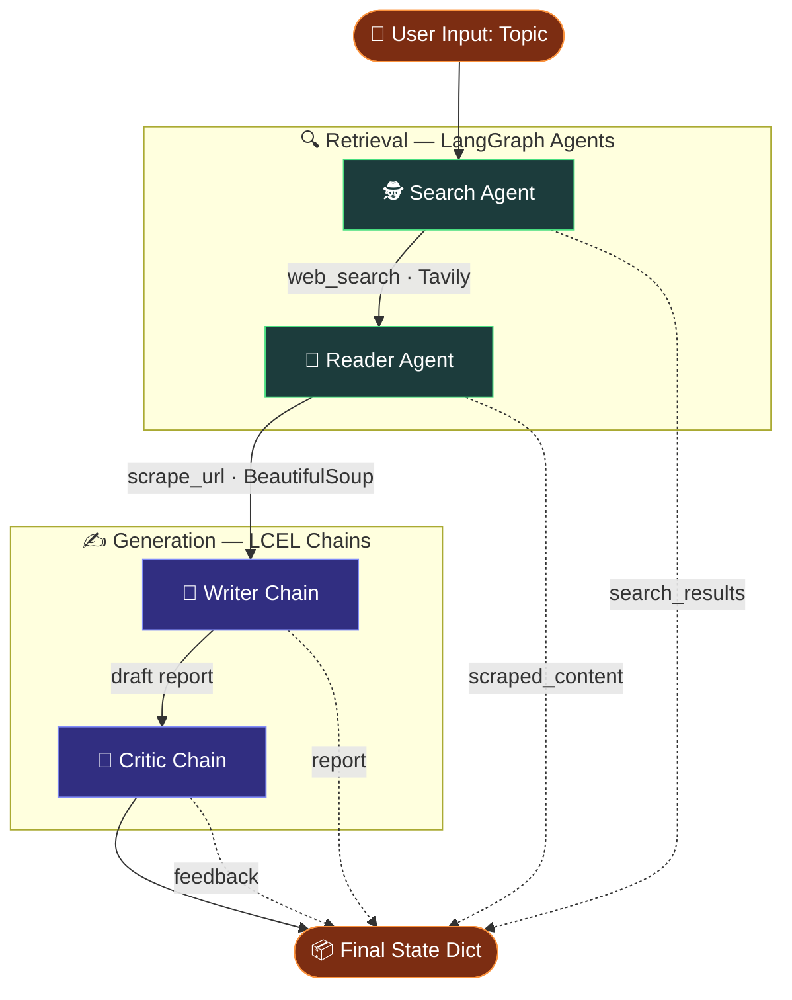
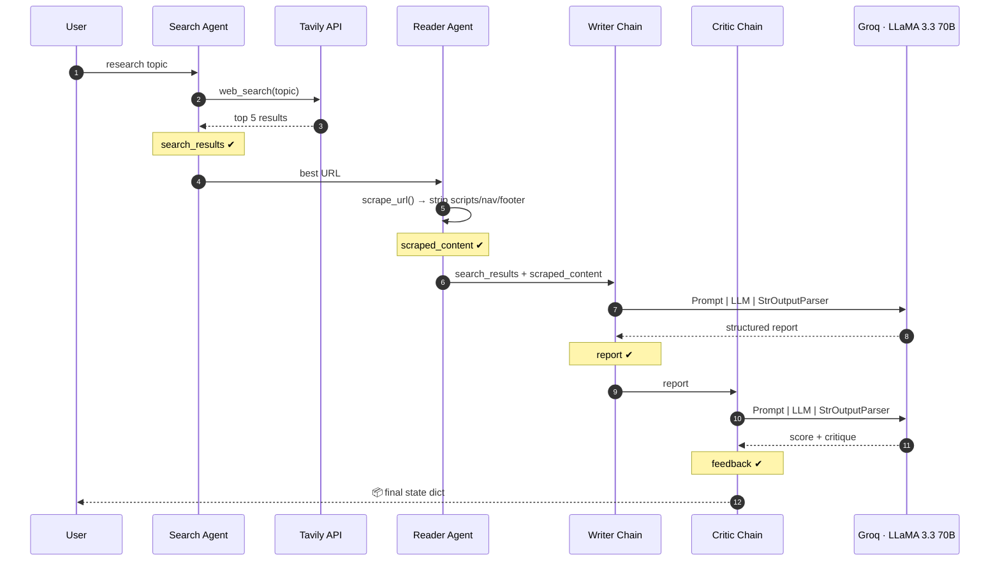
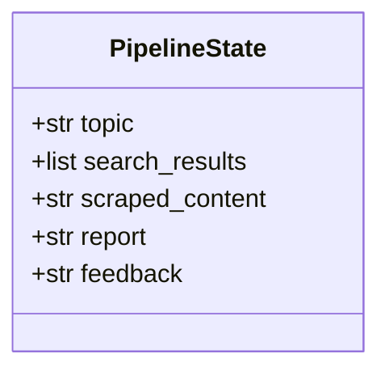

# 🧠 Multi-Agent AI Research Pipeline

> An autonomous, LangGraph-powered research system that **searches the web, scrapes sources, writes a structured report, and critiques its own work** — end to end, in a single run.

<p align="center">
  
  
  
  
  
  
</p>

---

## 📋 Table of Contents

- [Overview](#-overview)
- [Why This Design](#-why-this-design)
- [Features](#-features)
- [System Architecture](#-system-architecture)
- [Pipeline Flow](#-pipeline-flow)
- [Pipeline State](#-pipeline-state)
- [Agent & Chain Roles](#-agent--chain-roles)
- [Prerequisites](#-prerequisites)
- [Installation](#-installation)
- [Configuration](#-configuration)
- [Usage](#-usage)
- [Project Structure](#-project-structure)
- [Example Output](#-example-output)
- [Design Notes](#-design-notes)
- [Roadmap](#-roadmap)
- [License](#-license)

---

## 🔎 Overview

This project implements a **4-stage agentic research pipeline** built on **LangChain**, **LangGraph**, and **Groq's LLaMA 3.3 70B**. Given a single research topic, the system runs a chain of specialized components that each own one job:

| Stage | Component | What it does |
| :---: | --------- | ------------ |
| 1️⃣ | **Search Agent** | Finds the top relevant, recent web results for the topic |
| 2️⃣ | **Reader Agent** | Scrapes the most useful source for deeper, full-text content |
| 3️⃣ | **Writer Chain** | Drafts a full, structured, academic-style research report |
| 4️⃣ | **Critic Chain** | Scores the report and returns actionable critique |

The result is a single state dictionary containing the search results, scraped content, final report, and the critic's feedback — a transparent, inspectable record of every step.

---

## 💡 Why This Design

Every architectural choice here is deliberate:

| Decision | Rationale |
| -------- | --------- |
| **Agents for retrieval, chains for generation** | Searching and scraping need *tool-calling and reasoning* (LangGraph agents). Writing and critiquing are *deterministic transforms* of known input — plain LCEL chains are simpler, faster, and cheaper. |
| **LangGraph over a hand-rolled loop** | Gives an explicit, inspectable pipeline state and makes it trivial to add branches, retries, or a revision loop later. |
| **Groq inference** | LLaMA 3.3 70B on Groq's LPU hardware returns completions in a few hundred ms, so a 4-stage pipeline still finishes in seconds rather than minutes. |
| **A dedicated Critic stage** | Self-critique surfaces weak methodology and uncited claims *before* a human reads the report — turning a one-shot generator into a quality-gated one. |
| **BeautifulSoup scraping (strip scripts/styles/nav/footer)** | Clean, content-only text materially improves report quality vs. dumping raw HTML into the prompt. |

---

## ✨ Features

- 🤖 **Multi-Agent Architecture** — separate specialized agents for searching and reading
- 🌐 **Real-time Web Search** — powered by the **Tavily Search API**
- 📄 **Deep Content Scraping** — BeautifulSoup URL scraper that strips boilerplate
- ✍️ **Automated Report Writing** — structured academic-style reports via **LCEL** chains
- 🧠 **Self-Critique Loop** — a critic chain scores and reviews the generated report
- ⚡ **Groq Inference** — ultra-fast LLM responses with **LLaMA 3.3 70B**
- 🧾 **Fully Inspectable State** — every intermediate artifact is returned, not hidden

---

## 🏗 System Architecture



---

## 🔄 Pipeline Flow

A step-by-step view of how data moves and accumulates through the run:



---

## 📦 Pipeline State

The pipeline returns a single Python `dict` that grows as each stage completes. This is the contract every component reads from and writes to:



| Key | Written by | Type | Description |
| --- | ---------- | ---- | ----------- |
| `topic` | User | `str` | The research question entered at runtime |
| `search_results` | Search Agent | `list` | Top relevant web results from Tavily |
| `scraped_content` | Reader Agent | `str` | Cleaned full text of the best source |
| `report` | Writer Chain | `str` | Final structured research report |
| `feedback` | Critic Chain | `str` | Score + strengths + areas to improve |

---

## 🧩 Agent & Chain Roles

| Component | Type | Tool / Chain | Purpose |
| --------- | ---- | ------------ | ------- |
| `build_search_agent()` | LangGraph Agent | `web_search` (Tavily) | Finds top 5 relevant web results |
| `build_reader_agent()` | LangGraph Agent | `scrape_url` (BS4) | Scrapes the most relevant URL |
| `writer_chain` | LCEL Chain | Prompt + LLM + Parser | Drafts a structured research report |
| `critic_chain` | LCEL Chain | Prompt + LLM + Parser | Scores and critiques the report |

---

## ✅ Prerequisites

- **Python 3.9+**
- A **Groq API key** — [console.groq.com](https://console.groq.com)
- A **Tavily API key** — [tavily.com](https://tavily.com)

---

## ⚙️ Installation

```bash
# Clone the repository
git clone https://github.com/your-username/multi-agent-research-pipeline.git
cd multi-agent-research-pipeline

# Create and activate a virtual environment
python -m venv venv
source venv/bin/activate        # Windows: venv\Scripts\activate

# Install dependencies
pip install -r requirements.txt
```

**`requirements.txt`**

```
langchain
langchain-groq
langgraph
tavily-python
requests
beautifulsoup4
rich
python-dotenv
```

---

## 🔐 Configuration

Create a `.env` file in the project root:

```env
TAVILY_API_KEY=your_tavily_api_key_here
GROQ_API_KEY=your_groq_api_key_here
```

> ⚠️ `.env` is gitignored — never commit your keys.

---

## ▶️ Usage

```bash
python pipeline.py
```

You'll be prompted for a topic:

```
Enter a research topic : Impact of AI on healthcare
```

The pipeline runs all four stages and prints each step's progress and the final critic report to the console.

---

## 📁 Project Structure

```
multi-agent-research-pipeline/
├── tools.py           # Tool definitions: web_search, scrape_url
├── agents.py          # Agent builders + writer/critic LCEL chains
├── pipeline.py        # Main runner (run_research_pipeline)
├── .env               # API keys (not committed)
├── requirements.txt
└── README.md
```

---

## 🖥 Example Output

```text
step 1 - search agent is working ...
step 2 - reader agent is scraping top resources ...
step 3 - writer is drafting the report ...
step 4 - critic is reviewing the report ...

Critic Report:
Score: 8/10

Strengths:
- Well-structured with clear sections
- Includes relevant and recent sources

Areas to Improve:
- Methodology section could be more detailed
- Some claims lack direct citation

One-line verdict:
A solid, informative report with minor gaps in academic rigor.
```

---

## 🗒 Design Notes

- The pipeline state is returned as a Python `dict` with keys: `search_results`, `scraped_content`, `report`, `feedback`.
- The `scrape_url` tool strips `<script>`, `<style>`, `<nav>`, and `<footer>` tags for clean extraction.
- Writer and Critic chains use `ChatPromptTemplate` with structured output formatting.
- Retrieval uses LangGraph **agents** (tool-calling); generation uses lightweight **LCEL chains** — the right tool for each job.

---

## 🛣 Roadmap

- [ ] **Revision loop** — feed critic feedback back to the writer for a second draft when the score is below a threshold.
- [ ] **Multi-source scraping** — read the top *N* URLs instead of just the best one.
- [ ] **Citation enforcement** — require inline source attribution in the report.
- [ ] **Structured critic output** — return the score/strengths/gaps as JSON for programmatic gating.
- [ ] **Export** — save reports to Markdown / PDF.
- [ ] **Streaming UI** — a small web front end over the pipeline.

---

## 📄 License

MIT License — feel free to use, modify, and extend.

---

<p align="center"><i>Built to demonstrate multi-agent orchestration, tool-calling, and self-critiquing LLM pipelines with LangGraph + Groq.</i></p>
